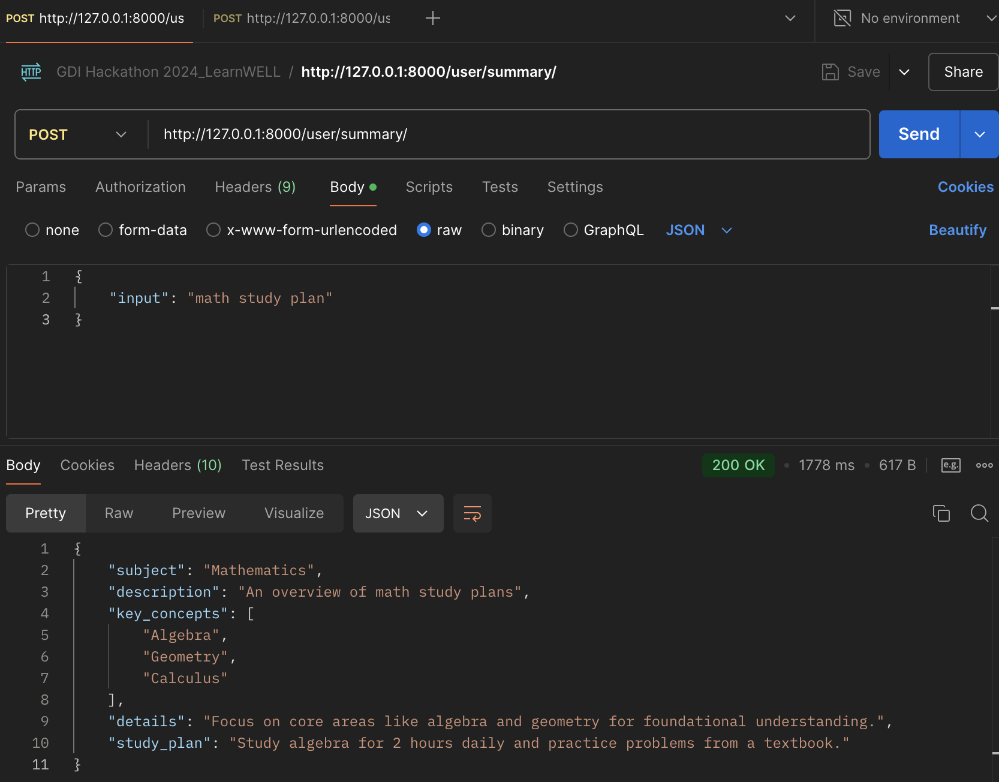

# Set up the backend environment

## Install dependencies
- Navigate to the backend directory:

    `cd learnwell-app-gdi-hackathon-2024/backend`

- Create a virtual environment:

    `python3 -m venv .venv`

- Activate the virtual environment:
    - On macOS/Linux:
    `source .venv/bin/activate`

    - On Windows:
    `.venv\Scripts\activate`

- Install the required Python packages:

    `pip install -r requirements.txt`

### Install additional dependencies if not already included in requirements.txt:

- Django Rest Framework:

    `pip install djangorestframework`


- Python Dotenv (for loading environment variables from a .env file):

    `pip install python-dotenv`

- OpenAI Python Library:

    `pip install openai`

    - Verify the installation of the openai package:

        `pip show openai`

        *Example output:*

        ```
        Name: openai
        Version: 1.54.4
        Summary: The official Python library for the openai API
        Home-page: https://github.com/openai/openai-python
        Author-email: OpenAI <support@openai.com>
        Location: /path/to/site-packages
        Requires: anyio, distro, httpx, jiter, pydantic, sniffio, tqdm, typing-extensions```
## Configure Environment Variables
1. Create a .env file in the root directory of the project (where manage.py is located).

2. Add the following line to your .env file:

    `OPENAI_API_KEY=your-api-key-here`

3. Secure your .env file: Add .env to .gitignore (if not already included) to ensure sensitive information is not tracked by git or uploaded to GitHub.

4. If you do not have an OpenAI API key:

- Go to [OpenAI API Overview](https://platform.openai.com/docs/overview).
- Log in or create an account.
- Click your name in the top-right corner, then select **Your Profile**.
- In the left menu, click **API Keys**, and then **+ Create new secret key**.
- Save the key immediately, as it won't be accessible again.
- Copy the key and place it in your .env file under OPENAI_API_KEY.


## Set up the database
Run the following command to migrate the database schema:

`python manage.py migrate`

## Start the development server
To run the backend server, use the following command:

`python manage.py runserver`

This will start the Django development server on http://127.0.0.1:8000/.


## Testing Backend Endpoints in Postman
Backend endpoints can be tested by making a call using Postman.
1. **Set Up Postman**:
   - Install the [Postman Desktop App](https://www.postman.com/downloads/) or use the [Postman Web Interface](https://web.postman.co).
   - Sign in with a free account if prompted.

2. **Example: Testing the `POST` /summary endpoint**:
   - Open Postman and create a new request.
   - Set the request type to `POST`.
   - Enter the URL for the endpoint. For example:
     ```
     http://127.0.0.1:8000/user/summary/
     ```

3. **Add the Request Body**:
   - Select the **Body** tab.
   - Choose `raw` and set the format to `JSON`.
   - Enter the request payload. Example:
     ```json
        {
            "input": "math study plan"
        }
     ```

4. **Send the Request**:
   - Click **Send** to make the request.

5. **Example Response**:
   - A successful response should have the status 200 OK and look like this in the body:
     ```json
        {
            "subject": "Mathematics",
            "description": "An overview of math study plans",
            "key_concepts": [
                "Algebra",
                "Geometry",
                "Calculus"
            ],
            "details": "Focus on core areas like algebra and geometry for foundational understanding.",
            "study_plan": "Study algebra for 2 hours daily and practice problems from a textbook."
        }
     ```

   - Here's a screenshot of what it should look like:


### Note:
Ensure your backend server is running before testing the endpoints by running `python manage.py runserver` in the terminal. Replace `http://127.0.0.1:8000` with the correct base URL in Postman if the server is hosted elsewhere.